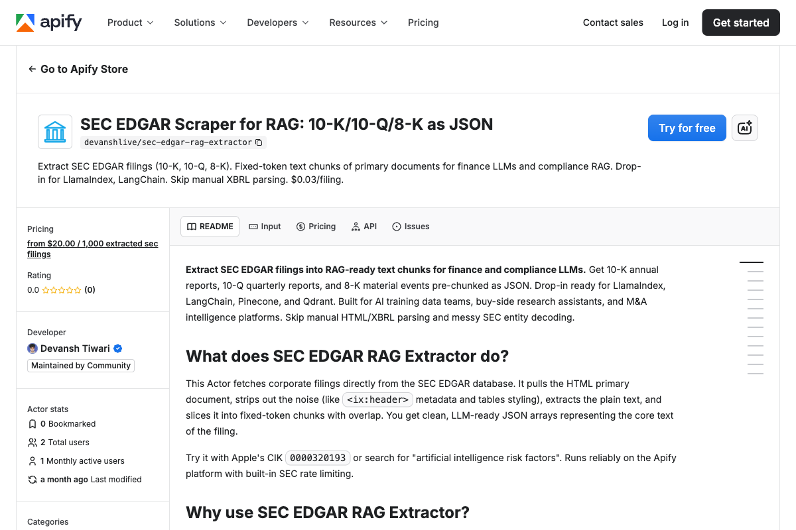

<div align="center">

# SEC EDGAR Scraper | Financial Data Extraction API | Apify Actor

[](https://apify.com/getascraper/sec-edgar-rag-extractor)
[](https://nodejs.org/)
[](https://github.com/getascraper)
[](https://github.com/getascraper/how-to-scrape-sec-edgar)

**SEC EDGAR scraper and financial data extraction API. Extract 10K, 10Q filings and SEC filings with this Apify actor. Free tier included.**

Built for finance AI developers, compliance analysts, and M&A researchers who need structured corporate disclosures without manual parsing.

[Quick Start](#quick-start) · [API Reference](#api-reference) · [Pricing](#pricing) · [Support](#support)



</div>

---

## Quick Start

```javascript
import { ApifyClient } from 'apify-client';
import 'dotenv/config';

const client = new ApifyClient({ token: process.env.APIFY_TOKEN });

const run = await client.actor('getascraper/sec-edgar-rag-extractor').call({
  cikList: ['0000320193'],
  formTypes: ['10-K'],
  dateFrom: '2024-01-01',
  dateTo: '2024-12-31',
  maxFilings: 5,
  userAgent: 'Jane Smith jane@acme.com',
});

const { items } = await client.dataset(run.defaultDatasetId).listItems();
console.log(items);
```

**Output:**
```json
{
  "accession_no": "0000320193-24-000012",
  "cik": "0000320193",
  "company_name": "Apple Inc.",
  "ticker": "AAPL",
  "form_type": "10-K",
  "filing_date": "2024-02-15",
  "period_of_report": "2023-09-30",
  "filing_url": "https://www.sec.gov/Archives/edgar/data/320193/000032019324000012/aapl-20230930.htm",
  "source": "full_text",
  "chunks": [
    {
      "idx": 0,
      "text": "The Company designs, manufactures and markets...",
      "tokens": 512
    }
  ]
}
```

---

## Features

- **10-K, 10-Q, 8-K forms** all supported in one Actor
- **CIK-based lookup** by company identifier
- **Exhibit stripping** for clean primary document extraction
- **cl100k_base tokenization** with 512 tokens per chunk
- **Financial metadata** including ticker, filing date, and reporting period

---

## What this actor does

This Actor extracts SEC EDGAR filings by CIK, form type, and date range. It parses the primary document (exhibits stripped) and returns structured JSON with financial metadata.

It supports 10-K (annual), 10-Q (quarterly), and 8-K (current event) filings. Each filing includes accession number, company name, ticker, filing date, and token-aware chunks.

---

## Installation

```bash
npm install
```

Copy the environment file and add your Apify API token:

```bash
cp .env.example .env
```

Open `.env` and replace `your_apify_token_here` with your actual Apify API token. Get one free at [console.apify.com](https://console.apify.com/settings/integrations).

---

## Input

| Field | Type | Description | Default |
|-------|------|-------------|---------|
| `cikList` | array | 10-digit Central Index Keys | none |
| `formTypes` | array | `10-K`, `10-Q`, `8-K` | none |
| `dateFrom` | string | Start date (YYYY-MM-DD) | none |
| `dateTo` | string | End date (YYYY-MM-DD) | none |
| `maxFilings` | integer | Max filings per company | 100 |
| `userAgent` | string | SEC-required user agent string | none |

---

## Output

Each filing is a structured JSON record with token-aware chunks. Download as JSON, CSV, Excel, or HTML.

| Field | Description |
|-------|-------------|
| `accession_no` | Unique SEC identifier for the filing |
| `cik` | 10-digit Central Index Key |
| `company_name` | Filer name |
| `ticker` | Stock ticker (if available) |
| `form_type` | 10-K, 10-Q, or 8-K |
| `filing_date` | Date submitted to the SEC |
| `period_of_report` | Reporting period end date |
| `filing_url` | Link to the SEC Archives primary document |
| `source` | `full_text` or `exhibits_stripped` |
| `chunks` | Fixed-token text chunks of the filing |
| `chunks[].idx` | 0-indexed position |
| `chunks[].text` | Chunk text |
| `chunks[].tokens` | Token count (≤ 512) |

See `sample-output.json` for a full example.

---

## Pricing

**$0.02 per filing.**

A run of 50 filings typically completes in 2 to 3 minutes. Pay only for what you extract.

---

## Use Cases

- **Finance AI:** Train models on clean corporate disclosures
- **Compliance RAG:** Build chatbots that cite specific regulatory filings
- **M&A research:** Feed target company 10-Ks into intelligence pipelines
- **Sell-side research:** Monitor 8-K events and earnings drift

---

## FAQ

**What is a CIK?**
A Central Index Key is a 10-digit identifier assigned by the SEC to each filer. You can find CIKs on the SEC's EDGAR search page.

**Why do I need a user agent?**
The SEC requires a user agent string for API access. Provide your name and email in the format: `Your Name your@email.com`.

**What forms are supported?**
10-K (annual), 10-Q (quarterly), and 8-K (current event) filings.

---

## Support

Open an issue in the [Apify Console](https://console.apify.com/actors/getascraper~sec-edgar-rag-extractor/issues).

---

## Related Resources

- [SEC EDGAR documentation](https://www.sec.gov/edgar/searchedgar/companysearch)
- [Apify Client for JavaScript](https://docs.apify.com/api/client/js/)

---

**Ready to start extracting?**

[Open the SEC EDGAR Scraper on Apify](https://apify.com/getascraper/sec-edgar-rag-extractor)
